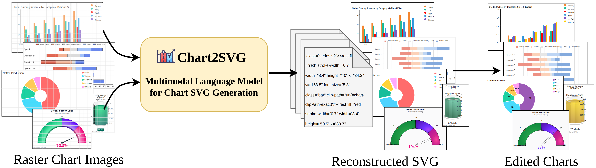

<h1 align="center">Chart2SVG: Editable SVG Generation from Raster Chart Images</h1>

<p align="center">
  <strong>Accepted to IEEE VIS 2026</strong>
</p>

<p align="center">
  
  <a href="https://huggingface.co/datasets/syslocker/Beagle_Plus"></a>
  <a href="https://github.com/JinningCui/Chart2SVG/blob/main/LICENSE"></a>
  
  <a href="https://swift.readthedocs.io/zh-cn/latest/GetStarted/SWIFT-installation.html"></a>
</p>

<p align="center">
  
</p>

Chart2SVG generates structured, editable SVG from raster chart images. This
repository contains the Beagle_Plus data-cleaning pipeline, semantic SVG
tokenization, Qwen3-VL model preparation, SFT and GRPO training, and inference
scripts.

The five supported Beagle_Plus sources are ChartBlocks, FusionCharts, Graphiq,
Plotly, and Apache ECharts. The dataset is available on
[Hugging Face](https://huggingface.co/datasets/syslocker/Beagle_Plus).

## Repository layout

```text
Chart2SVG/
├── assets/figures/fig1.png
├── data/                         # Cleaning and semantic-data generation
│   ├── data_clean.sh
│   ├── gen_semantic_svg.sh
│   ├── split_dataset.py
│   ├── semantic_tokens.py
│   ├── requirements.txt          # Lightweight data environment
│   └── requirement.txt           # Pinned training environment
├── model/
│   ├── prepare_svg_qwen.py
│   └── test_tokens.py
├── scripts/
│   ├── sft/lora_sft.sh
│   ├── grpo/
│   │   ├── grpo.sh
│   │   ├── roll_out.sh
│   │   ├── plugin.py
│   │   └── prompt.txt
│   └── inference/
│       ├── run_inference_and_render.py
│       └── batch_inference.py
├── svglib/
└── merge_lora.sh
```

## Installation

Python 3.10 or newer is required; Python 3.12 is recommended by the
[ms-swift installation guide](https://swift.readthedocs.io/zh-cn/latest/GetStarted/SWIFT-installation.html).

Clone the repository:

```bash
git clone https://github.com/JinningCui/Chart2SVG.git
cd Chart2SVG
```

For data cleaning:

```bash
python3 -m venv .venv
source .venv/bin/activate
python -m pip install -r data/requirements.txt
npm install
```

The cleaning pipeline also requires Cairo. On macOS:

```bash
brew install cairo pango libffi
```

For the pinned Linux CUDA training environment:

```bash
python3.12 -m venv .venv-training
source .venv-training/bin/activate
python -m pip install -U pip

git clone https://github.com/modelscope/ms-swift.git ms-swift
python -m pip install -r data/requirement.txt
```

The full lock file includes PyTorch 2.8.0, Transformers 4.57.6, and vLLM
0.11.0. Use versions compatible with your CUDA environment. After ms-swift is
configured, replace the corresponding scripts under `ms-swift/examples/train/`
with this repository's customized `scripts/sft/`, `scripts/grpo/`, and other
matching scripts.

## Data preparation

Place the five datasets under one Beagle root:

```text
<Path to Beagle_Plus>/
├── chartblocks/
├── fusion_clean/
├── graphiq_clean/
├── plotly_export/
└── echarts/
```

Clean all datasets:

```bash
PYTHON_BIN="$PWD/.venv/bin/python" ./data/data_clean.sh
```

Generate semantic SVG and Qwen-format JSON:

```bash
./data/gen_semantic_svg.sh \
  --base-dir "Path to your Beagle_Plus dataset" \
  --python "$PWD/.venv/bin/python"
```

Split merged JSON into one file per training sample:

```bash
"$PWD/.venv/bin/python" data/split_dataset.py \
  --source-dir "Path to your train_json directory"
```

Cleaned SVG and rendered PNG files are written into each chart directory.
Semantic SVG is saved as `train_svg.txt`, and training conversations are
written under `train_json/`.

## Model preparation

Place the base Qwen3-VL model under `models/`, adjust the paths or GPU in the
script when needed, and initialize semantic SVG token embeddings:

```bash
python model/prepare_svg_qwen.py
```

Check token lengths before training. The default mode only reports; add
`--delete` only after reviewing the results:

```bash
python model/test_tokens.py \
  --model "Path to your initialized model" \
  --dataset-dir "Path to your split training dataset"
```

## Training

Replace the descriptive model and dataset placeholders in the scripts before
running them.

### SFT

```bash
bash scripts/sft/lora_sft.sh
```

To merge a LoRA checkpoint, update `CKPT_DIR` and `OUTPUT_DIR` in
`merge_lora.sh`, then run:

```bash
bash merge_lora.sh
```

### GRPO

Set the model, dataset, and plugin paths in the GRPO scripts. Start the rollout
server first:

```bash
bash scripts/grpo/roll_out.sh
```

Then start training in another terminal:

```bash
bash scripts/grpo/grpo.sh
```

The custom `svg_pipeline` reward validates and renders generated SVG, then
compares it with the reference chart using IoU, SSIM, and PSNR.

## Inference

Run inference and render SVG/PNG outputs:

```bash
python scripts/inference/run_inference_and_render.py \
  --checkpoint_path "Path to your checkpoint" \
  --dataset_path "Path to your dataset JSON" \
  --output_dir "Path to your inference output" \
  --resized_dir "Path to your normalized images"
```

For multiple datasets, configure and run:

```bash
python scripts/inference/batch_inference.py
```

## License

The code is released under the [MIT License](LICENSE). Source datasets retain
their respective licenses and terms of use.
